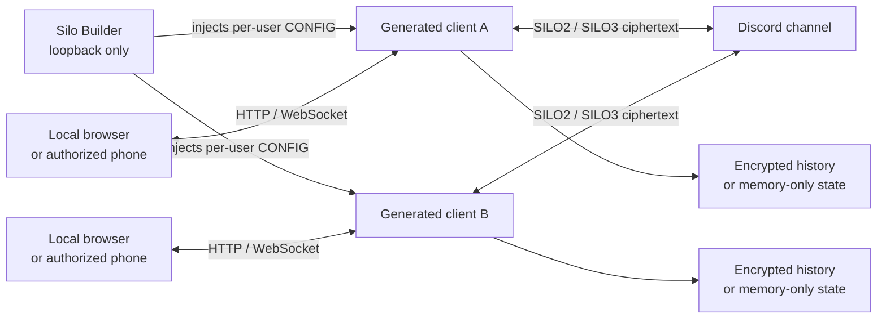
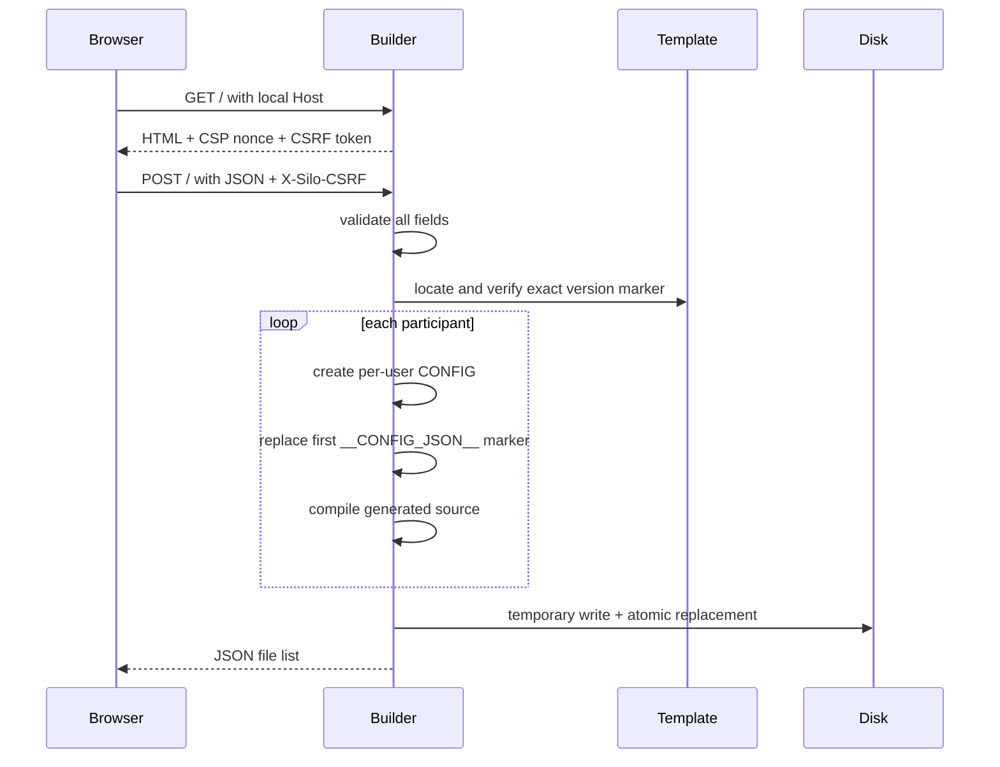
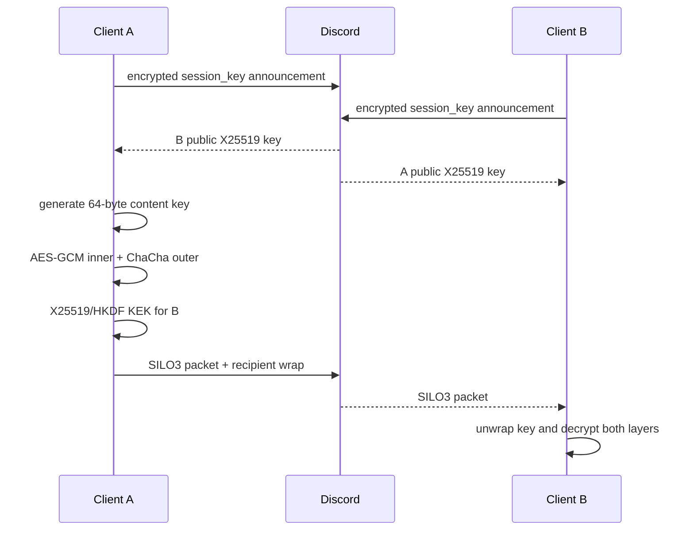

# Silo Client 2.0


<div align="center">

**Locally generated, browser-based end-to-end encrypted messaging over Discord transport.**

[](https://python.org)
[](#silo-20)
[](#cryptographic-model)

[Official website](https://siloclient.space) · [Installation](#installation) · [Security](#security-model) · [Protocol](#wire-protocols) · [Troubleshooting](#troubleshooting) · [Screenshots](#screenshots)

</div>

## What Silo is

Silo is a two-script system that generates one self-contained Python client per participant. Each generated client combines:

- A Discord bot used as the remote transport.
- A local `aiohttp` HTTP/WebSocket server.
- A responsive browser chat interface.
- Client-side encryption before anything is posted to Discord.
- Optional encrypted local history or memory-only chat state.
- Optional password-protected mobile access on the same LAN.

Discord transports encrypted text envelopes and encrypted attachment chunks. It can still observe transport metadata such as bot accounts, server/channel, timestamps, traffic volume, approximate sizes, and attachment count. It does not receive the event JSON or file bytes in plaintext from an unmodified Silo client.



## Silo 2.0

The current product release documented here is **Silo 2.0**. Some source constants identify internal template compatibility, event schemas, or wire protocols. They are not separate Silo product releases:

| Identifier | Value | Meaning |
|---|---|---|
| Product version | `2.0` | Current Silo release |
| Builder version | `2.0` | Displayed by `silo_builder_web.py` |
| Template compatibility marker | `2.0.1-configurable-dual-aead` | Exact internal marker required by the Builder; not the product version |
| Client module description | Internal descriptive text | A stale source docstring; it does not change the Silo 2.0 product version |
| Event schema | `v: 2` | Clear event structure after decryption |
| Base protocol label | `silo-v2` | Used in AAD/export metadata |
| Session protocol label | `silo-v3` | X25519 group-envelope label |
| Text prefixes | `SILO2:` / `SILO3:` | Discord wire-format dispatch prefixes |

Protocol/schema numbers identify formats only. Throughout this README, “Silo version” always means **Silo 2.0**.

## Feature matrix

| Area | Feature | Actual status |
|---|---|---|
| Messaging | Text messages | Active; 1–900 characters |
| Messaging | Replies and mentions | Active; reply reference and up to 20 numeric mention IDs |
| Messaging | Edit and delete | Active; authors may edit/delete their own messages |
| Messaging | Revision history | Active; last 20 prior versions per message |
| Messaging | Pin and highlight | Active |
| Messaging | Reactions | Active; 👍, ❤️, 😂, 🔥, ✅, 👀 |
| Messaging | Read/delivery receipts | Builder-configurable |
| Privacy | Disappearing messages | Builder-configurable; TTL capped at 86,400 seconds |
| Privacy | View-once messages | Builder-configurable; one receiver-triggered opening event |
| Organization | Topics/subrooms | Builder-configurable; maximum 20 including `lobby` |
| Organization | Topic roles | Active with topics: `owner`, `admin`, `member`, `read_only` |
| Communication | Presence and typing | Builder-configurable; online/idle/away/offline and typing |
| Files | Encrypted attachments | Builder-configurable; maximum 1,500,000 bytes |
| Audio | Browser voice notes | Builder-configurable; sent through attachment protocol |
| Polls | Create and vote | Builder-configurable; 2–8 options |
| Search | Search UI and filters | Builder-configurable; operates on local loaded state |
| Transfer | Encrypted export and event import | Active; import accepts at most 5,000 events |
| Deletion | Local clear | Active |
| Deletion | Consensus room clear | Active; targets currently active participants |
| Emergency | Panic button/global hotkey | Builder-configurable; remote panic is rejected |
| Storage | Layered encrypted history | Enabled by default; configurable |
| Storage | Memory-only chat history | Disabled by default; configurable |
| Mobile | QR/LAN browser access | Builder-configurable; requires local password setup |
| Appearance | Themes, accents and wallpaper | Builder-configurable; browser-local preferences |
| Diagnostics | Security center/statistics | Independently Builder-configurable |
| Compatibility | Older event/file/session formats | Read-only compatibility |

## Installation

### 1. Requirements

- Python 3.10 or newer is recommended.
- `pip` available for that Python installation.
- Internet access for installing dependencies and connecting to Discord.
- A Discord account able to create applications/bots and configure a server channel.
- One Discord bot token per Silo participant.
- A modern browser. Voice notes additionally require browser media-capture support.
- For mobile access, the computer and phone must be on the same trusted LAN and the computer firewall must allow the selected TCP port.

### 2. Download the project files

Keep these files together in the same directory:

```text
Silo/
├── silo_builder_web.py
├── silo_client_template.py
└── requirements.txt
```

The Builder also accepts `_silo_client_template.py`, and searches both its own directory and the current working directory. The exact template-version marker must be present.

### 3. Install the dependencies

Install the packages directly with the Python installation that will run Silo.

#### Windows

```powershell
pip install -r requirements.txt
```

#### macOS / Linux

```bash
python3 -m pip install -r requirements.txt
```

If `pip` is linked to the intended Python interpreter, the universal short form is:

```bash
pip install -r requirements.txt
```

Generated clients also contain an automatic fallback installer. At startup they import each required module and invoke `python -m pip install ...` only for missing modules. Installing from `requirements.txt` first is preferable because dependency errors are discovered before the chat starts.

### 4. Create Discord bots

Repeat this for every participant:

1. Open the Discord Developer Portal.
2. Create an application and add a bot.
3. Copy the bot token and keep it secret.
4. Enable the privileged **Message Content Intent**. The code explicitly sets `intents.message_content = True`.
5. Invite the bot to the server containing the transport channel.
6. Grant the minimum permissions required by the implemented operations: view the channel, read message history, send messages, and attach files.
7. Record the server ID, channel ID, and bot/user ID. Developer Mode in Discord makes IDs available through “Copy ID”.

Silo does not automate Developer Portal setup, bot invitation, intent activation, or channel permission configuration.

### 5. Run the Builder

```bash
python silo_builder_web.py
```

The Builder binds only to `127.0.0.1`, chooses an OS-assigned port when called normally, prints the URL, and opens it after approximately 450 ms.

### 6. Configure the room

Enter:

- Discord server and channel IDs.
- A primary shared secret of at least 16 characters.
- A distinct secondary secret of at least 16 characters when dual-layer encryption is enabled.
- Starting local port, default `8081`.
- Auto-lock interval, 30–3,600 seconds.
- Session content-key rotation interval, 1–10,000 sent messages.
- Between 1 and 100 participant records, each with token, numeric ID, and unique display name.
- Every desired feature switch.

The Builder’s key buttons generate 32 characters using Web Crypto `crypto.getRandomValues`. Its entropy display is only a length/alphabet estimate.

### 7. Generate clients

Press **Generate encrypted clients**. Despite internally constructing an in-memory ZIP, this Builder revision saves the extracted results beside the Builder:

```text
silo_client_1.py
silo_client_2.py
...
```

It writes to a temporary file and atomically replaces the destination. Existing files with those names are overwritten. It also compiles every generated source string before saving, so malformed injection fails generation.

### 8. Distribute one client per participant

Each generated Python file embeds:

- Its Discord bot token.
- Both room secrets when dual-layer mode is enabled.
- Server/channel IDs.
- User identity and port.
- A per-client random web access token.
- All feature settings.

Treat generated clients as secret-bearing credentials. Distribute them through an authenticated secure channel. If a member leaves, a client leaks, or either room secret is exposed, generate a new room configuration and redistribute every client.

### 9. Start each generated client

```bash
python silo_client_1.py
```

The client loads history, registers the panic hotkey where possible, starts Discord, starts the web server, opens the local UI, and runs maintenance concurrently. It prints the effective local and LAN URLs.

### 10. Verify the installation

1. Confirm each console prints a local Web UI address.
2. Confirm Discord connection succeeds and no server/channel access error appears.
3. Compare the displayed room fingerprint/key ID between participants through a separate trusted channel.
4. Send a short test message and an attachment.
5. Restart one client and confirm encrypted history reloads if persistence is enabled.
6. If mobile access is wanted, configure its password locally before scanning the QR.

## Dependencies

`requirements.txt` exactly mirrors the ranges declared by `_load_dependencies()`:

| Package | Range | Purpose |
|---|---|---|
| `aiohttp` | `>=3.10,<4` | Local HTTP and WebSocket server |
| `discord.py` | `>=2.4,<3` | Discord transport |
| `cryptography` | `>=44,<47` | KDFs, HKDF, X25519, AES-GCM and ChaCha20-Poly1305 |
| `psutil` | `>=6,<8` | Host/process/network diagnostics |
| `qrcode[pil]` | `>=7.4,<9` | Mobile-access QR PNG |
| `pynput` | `>=1.7,<2` | Global panic hotkey |

The runtime import check does not verify the version of an already importable package. Argon2id has a Scrypt fallback. If `pynput` cannot initialize because of OS, display-server, or permission constraints, the client continues without the global hotkey.

## Builder internals



### Builder routes

| Method | Path | Behavior |
|---|---|---|
| `GET` | `/` | Configuration UI |
| `GET` | `/health` | Returns `{"ok":true}` |
| `POST` | Any path | Generation handler; the UI posts to its current URL, normally `/` |

### Builder validation

- Server/channel: positive decimal integers.
- Primary key: at least 16 characters.
- Secondary key: at least 16 characters and different from primary when dual-layer mode is active.
- Participants: 1–100.
- Bot token: at least 30 characters and at least two periods. This is a shape check, not online verification.
- User ID: positive decimal integer and unique.
- Username: non-empty, at most 40 characters, no CR/LF/tab, case-insensitively unique.
- Starting/final generated ports: 1024–65535.
- Auto-lock: 30–3,600 seconds.
- Key rotation: 1–10,000 messages.
- Boolean options must be actual JSON booleans.
- Request body: 1–2,000,000 bytes.

### Builder security controls

- Fixed loopback bind on `127.0.0.1`.
- Rejects a `Host` not resolving textually to `localhost` or `127.0.0.1`.
- Per-process 32-byte URL-safe random token used as CSRF token and CSP script nonce.
- Checks `Origin` when supplied.
- `Cache-Control: no-store`, `Referrer-Policy: no-referrer`, `nosniff`, `X-Frame-Options: DENY`.
- CSP: deny by default, inline style allowed, only the nonce-bearing script, self connections.
- Suppressed HTTP request logging.
- Expected validation errors return JSON; unexpected exceptions return a generic HTTP 500 response.

## Generated configuration reference

| Key | Type/default | Meaning |
|---|---|---|
| `bot_token` | required string | This client’s Discord credential |
| `server_id`, `channel_id` | required integers | Transport room; combined as `ROOM=server:channel` |
| `shared_key` | required string | Primary password input to memory-hard KDF |
| `secondary_key` | required in dual mode | Independent secondary KDF input |
| `kdf_salt` | Builder-generated | Shared room salt, generated once per build |
| `web_access_token` | per-client random | Secret embedded in mobile QR/link |
| `user_id` | required integer | Logical sender/recipient identifier |
| `username` | string | Initial clean display name |
| `port` | integer, starts at 8081 | Requested local web port |
| `memory_only` | `false` | Skips chat-history saves |
| `dual_layer_encryption` | `true` | Uses current double-AEAD formats |
| `encrypted_local_history` | `true` | Encrypts history container at rest |
| `auto_lock_seconds` | `300` | Browser UI lock timeout |
| `key_rotation_interval` | `50` | Session content-key rotation threshold |
| `read_receipts` | `true` | Enables receipt emission in UI |
| `show_security_panel` | `true` | Security panel visibility |
| `show_statistics` | `true` | Statistics visibility |
| `enable_topics` | `true` | Topic UI/actions |
| `enable_search` | `true` | Search UI |
| `enable_presence` | `true` | Presence/typing UI and actions |
| `enable_attachments` | `true` | Attachment UI/actions |
| `enable_voice_notes` | `true` | Voice recorder UI; also requires attachments |
| `enable_polls` | `true` | Poll UI/actions |
| `enable_view_once` | `true` | View-once sending/opening |
| `enable_disappearing` | `true` | TTL controls |
| `enable_wallpapers` | `true` | Wallpaper controls |
| `enable_mobile_access` | `true` | LAN mobile authentication and UI |
| `enable_panic` | `true` | Panic UI/hotkey registration path |

`panic_hotkey` is read by the template and defaults to `<ctrl>+<shift>+<alt>+k`, but the supplied Builder has no field for it. It is template-compatible configuration, not a Builder-exposed option.

## Client startup and runtime

1. Import required modules and install missing packages if needed.
2. Read injected `CONFIG` and create room constants.
3. Derive primary and secondary master keys.
4. Create `CryptoBox` and bounded `SessionRatchet`.
5. Create Discord client with message-content intent.
6. Derive isolated local-storage paths and create the directory.
7. Load encrypted/plain history or start empty.
8. Register the panic hotkey when configured and supported.
9. Concurrently run Discord, web server, and one-second maintenance loop.
10. On Discord ready: resolve guild/channel, announce presence, X25519 session key, and profile.

The web server binds `0.0.0.0`. If the requested port is busy, it tests 100 following offsets plus the original attempt, wrapping above 65535 to 1024. The effective port is stored only in memory and printed.

## Cryptographic model

### Base key derivation

- Primary key: Argon2id, 32-byte output, 128 MiB memory, 3 iterations, 4 lanes.
- Fallback when Argon2id import is unavailable: Scrypt with `N=2^17`, `r=8`, `p=1`, 32-byte output.
- Configured salt is URL-safe Base64-decoded and truncated to 32 bytes.
- If decoded salt is shorter than 16 bytes, fallback salt is `SHA-256("SiloClient/v2/fallback/" || ROOM)`.
- Secondary salt is `SHA-256(primary_salt || "SiloClient/secondary-kdf/v1")`.
- A supplied secondary password is independently memory-hard-derived.
- If no secondary password exists in a compatibility configuration, HKDF derives one from the primary master key. This is not independent-secret dual encryption.

Primary and secondary key commitments are HMAC-SHA-256 values truncated to 8 bytes. The UI fingerprint is the first 12 uppercase hex characters of `SHA-256(primary_master_key)`.

### Topic and purpose separation

AES and ChaCha subkeys are independently derived with HKDF-SHA-256. Salt/info labels include protocol version, `ROOM`, purpose, topic, and for current traffic the one-hour epoch. Topic IDs are 1–48 characters and permit only ASCII letters, digits, `_`, and `-`.

Each cipher cache is capped at 128 entries. Oldest dictionary entries are removed when the cap is exceeded.

### Nonces and replay handling

- Online `CryptoBox` nonces are 96 bits: random 4-byte process prefix plus an increasing 8-byte counter.
- The counter starts at a random value below `2^32`.
- Nonce allocation is protected by a thread lock.
- Exhaustion before `2^64-1` raises and requires restart.
- Replay tokens are 16-byte BLAKE2s hashes of scope plus nonce.
- FIFO replay cache maximum: 20,000.
- Replays are checked before decryption and remembered only after successful authentication.
- The replay cache is not persisted, so replay memory resets with the process.

### SILO2 current event encryption

Clear events are canonical compact JSON with sorted keys. Current formats prepend a two-byte clear length, pad to a 64-byte bucket, and randomly add zero or one extra bucket. Padding bytes are cryptographically random and authenticated.

Dual mode writes header `(6,2)`:

1. Header: version/type, primary commitment, secondary commitment, 4-byte epoch.
2. Inner AES-256-GCM with its own nonce and event-specific AAD.
3. Outer ChaCha20-Poly1305 with another nonce, encrypting `inner_nonce || inner_ciphertext`.
4. Wire body: header, outer nonce, outer ciphertext.

Single-layer compatibility mode writes header `(5,2)` and uses AES-256-GCM only, while retaining commitment, epoch, padding, and AAD.

Epoch duration is 3,600 seconds. Decryption accepts a difference of at most 48 epochs, approximately ±48 hours.

### SILO3 bounded session ratchet

The source explicitly states that `SessionRatchet` is **not Signal’s Double Ratchet**. It is an asynchronous group envelope with per-client X25519 identities and rotating content keys.



- X25519 identity is generated at startup.
- Identity rotation retains the current and one previous private key for in-flight messages; normal runtime does not schedule periodic identity rotation.
- Content key is 64 random bytes: 32 for AES-GCM, 32 for ChaCha20-Poly1305.
- Session ID is 12 random bytes encoded as 24 hex characters.
- Content key rotates after the configured count of sent ratchet messages.
- Each known peer except self receives an AES-GCM wrap.
- KEK is X25519 shared secret through HKDF-SHA-256, with master key as salt and room/sender/recipient/session in `info`.
- Packet AAD binds protocol, algorithm label, room, topic, sender, session, and ephemeral public key.
- Received-key cache is limited to 32 session entries; removed bytearrays are overwritten best-effort.
- If no peers are known, the event is a session announcement, or the packet exceeds 1,950 characters, the sender falls back to SILO2.

### Wire compatibility

| Format | Read | Write | Meaning |
|---|---:|---:|---|
| `SILO3`, packet v4 | Yes | Preferred when peers are known and it fits | X25519 wraps, AES inner, ChaCha outer |
| `SILO3`, packet v3 | Yes | No | Legacy X25519/AES session envelope |
| `SILO2`, `(6,2)` | Yes | Yes in dual mode | Current dual-layer events |
| `SILO2`, `(5,2)` | Yes | Yes in single mode | Current padded AES events |
| `SILO2`, `(4,2)` | Yes | No | Legacy epoch AES event |
| `SILO2`, `(3,2)` | Yes | No | Legacy committed-key AES event |
| `SILO2`, `(2,2)` | Yes | No | Legacy topic derivation |
| File `(6,3)` | Yes | Yes in dual mode | Current dual-layer file chunk |
| File `(4,2)` | Yes | Yes in single mode | Current epoch AES file chunk |
| File `(3,2)` | Yes | No | Legacy committed-key chunk |
| Headerless file chunk | Yes | No | Oldest legacy attachment format |

Legacy support is reception compatibility, not a promise that every historical client can read current output.

## Clear event protocol

Every decrypted event has this structure:

```json
{
  "v": 2,
  "room": "server_id:channel_id",
  "topic_id": "lobby",
  "event_id": "UUID",
  "kind": "message",
  "sender_id": "numeric ID as text",
  "sender_name": "User",
  "ts": "ISO-8601 UTC timestamp",
  "data": {}
}
```

Accepted kinds are:

`message`, `edit`, `delete`, `pin`, `highlight`, `profile`, `presence`, `import`, `clear_request`, `clear_vote`, `clear_cancel`, `clear_commit`, `topic_create`, `topic_rename`, `topic_delete`, `typing`, `session_key`, `file_start`, `file_chunk`, `file_complete`, `reaction`, `receipt`, `poll_create`, `poll_vote`, `view_once_open`, and `role_set`.

Content events must not use `_control`; control events must use `_control`. UUIDs, timestamps, sender IDs, event-specific lengths, states, hashes, chunk indices, poll options, and session announcements are validated before application.

Duplicate `event_id` values are ignored. Delayed content at or before a committed clear epoch is recorded as seen but cannot resurrect cleared state.

## Topic roles and authorization

- `lobby` exists by default and cannot be renamed or deleted.
- A room supports at most 20 topics total.
- Topic creator is implicitly `owner`.
- Other users default to `member` unless assigned another role.
- Topic owner may assign `admin`, `member`, or `read_only` on non-lobby topics.
- Owner cannot alter the owner’s own role.
- `read_only` blocks message/edit/delete, reaction, file transfer, poll creation, and voting.
- Only the message author can edit or delete it.
- Any recognized message may be pinned or highlighted by current logic.
- Only the topic creator can rename/delete that topic.

These checks are performed independently by each client. They are application authorization, not signatures from independently certified user keys.

## Attachment protocol

1. `file_start` sends transfer UUID, sanitized name, MIME, byte size, chunk total, and lowercase SHA-256.
2. Payload is split into 224 KiB (`229,376` byte) chunks.
3. Each chunk is independently encrypted with AAD binding room, topic, transfer ID, and index.
4. A separately encrypted `file_chunk` event is sent as Discord text, with exactly one `.silo` Discord attachment.
5. `file_complete` repeats the expected SHA-256.
6. Receiver requires every chunk, exact size, and constant-time digest equality before marking ready.

The maximum file size is 1,500,000 bytes, yielding at most seven chunks. At most 100 reconstructed attachments remain in memory. Chunk bytes are not written into local history, so attachments are unavailable after restart unless received again. Inline preview is allowed for image, audio, text, and PDF MIME prefixes/types; other content downloads as an attachment.

## Messages, polls, presence, and receipts

- Message content: 1–900 characters.
- Reply target is stored but not cryptographically checked to exist.
- Up to 20 numeric mention IDs are stored.
- Edit preserves up to 20 previous revisions; only author edits.
- Delete clears content and leaves a tombstone until room clearing.
- Reactions toggle the sender’s ID in the chosen emoji list.
- Poll question is truncated to 240 characters; each of 2–8 options to 100 characters.
- One current vote per sender per poll; a later valid vote replaces it.
- Typing TTL is 3 seconds; local emission is rate-limited to 2.25 seconds.
- Typing timestamps must be near current time and no more than 5 seconds ahead.
- Presence is announced about every 10 seconds.
- A participant becomes inferred `away` after 95 seconds and `offline` after 300 seconds without activity.
- Read receipts accept `delivered` or `read` and are stored only for non-authors.

## Local history and storage

Storage root:

```text
~/.silo_client/<16-char room hash>/<24-char client identity hash>/
```

Room hash is derived from `ROOM`. Client identity hash includes user ID, primary/secondary key commitments, and port. Regenerating a room with new keys therefore selects a different isolated history directory.

### Encrypted mode

The `SILOHIST2\0` container uses:

1. Per-user/per-room HKDF-derived AES-256-GCM key.
2. AES-GCM inner encryption with random nonce.
3. Independently HKDF-derived ChaCha20-Poly1305 key.
4. ChaCha outer encryption of `inner_nonce || inner_ciphertext` with another nonce.
5. AAD binds magic, room, user identity, and layer.

### Plaintext mode

When `encrypted_local_history=false`, history is JSON and has no at-rest confidentiality.

### Memory-only mode

When `memory_only=true`, `save_history()` returns without writing chat history. This does **not** mean zero disk writes: the client directory is created, mobile password configuration can be written, dependencies may be installed, and browser storage can contain UI preferences/wallpapers.

### Persistence contents and caps

- Messages and topics.
- Up to 10,000 seen event IDs.
- Up to 10,000 logged events.
- Up to 50 clear proposals.
- Clear epoch.
- Polls.
- Last 100 activity entries.
- No reconstructed attachment bytes, presence table, or typing state.

Writes use a process-specific temporary filename, attempt mode `0600`, and atomic replacement. Plain JSON legacy history is migrated to encrypted history when encryption is enabled. Authentication/decoding failure quarantines the encrypted file with a timestamp and starts an empty state.

## Browser UI

- Dark “Obsidian” visual system, aurora/grid/grain effects, responsive desktop/tablet/mobile layouts.
- Reduced-motion media-query handling.
- Topic navigation, unread dots, rename/delete controls, and per-topic drafts.
- Reply bar, context menu, reactions, pin/highlight, edit/delete, new-message indicator.
- Search dialog with filters over locally loaded data.
- Participants/presence popover.
- Security and room-details drawer.
- Statistics for CPU, RAM, disk, network, process, Python/OS, Discord latency, delivery latency, event counts, encryption counters, rejections, caches, WebSockets, topics, files, and uptime.
- Wallpaper/theme/accent customization in browser-side storage.
- Auto-lock UI using the configured timeout. It is a browser-interface lock, not process-key erasure.
- Feature switches hide corresponding controls and several server-side WebSocket actions are also blocked.

### View-once behavior

When a receiver opens a view-once message, plaintext is sent only to that already-authorized local WebSocket before an authenticated `view_once_open` event clears shared message content. The reveal overlay:

- Closes after 15 seconds.
- Closes on focus loss or hidden tab.
- Blocks copy, cut, context menu, and drag in the overlay.
- Hides under print CSS.
- Adds a visible watermark.
- Attempts to intercept `PrintScreen` and clear clipboard.

Browser controls cannot reliably prevent OS-level capture, external cameras, malicious software, or modified clients.

## Local and mobile web access

### Endpoints

| Method | Route | Access | Function |
|---|---|---|---|
| `GET` | `/` | Loopback or authorized mobile | App, mobile login, or setup-pending page |
| `GET` | `/ws` | Same authorization | State/telemetry/actions; 20 s heartbeat, 2 MB max message |
| `GET` | `/qr.png` | Loopback only | QR PNG containing LAN access link |
| `GET` | `/api/attachment/{transfer_id}` | Authorized | Ready in-memory attachment |
| `POST` | `/api/mobile-password` | Loopback only | Set/replace mobile password |
| `POST` | `/api/mobile-login` | Valid QR/link token | Verify password and issue session cookie |

Application maximum request body is 3,000,000 bytes.

### Mobile authentication details

- LAN URL: `http://LAN_IP:port/?access=web_access_token`.
- LAN IP is discovered by opening a UDP routing probe to `8.8.8.8:80`, falling back to hostname resolution and then loopback. No chat data is sent by that probe.
- Remote access requires mobile feature enabled, valid link token, and valid password session.
- Password length: 12–256 characters.
- Password verifier: Scrypt `N=2^16`, `r=8`, `p=1`, random 16-byte salt.
- Only salt, verifier, session key, version, and change timestamp are stored; not the password.
- Session token: expiry plus HMAC-SHA-256 under a random local session key.
- Maximum session duration: 8 hours.
- Changing password rotates the session key and invalidates prior sessions.
- Invalid password adds a 350 ms delay.
- Link/session cookies are `HttpOnly` and `SameSite=Strict`, but not `Secure` because transport is plain HTTP.
- No general login-attempt counter or per-IP persistent lockout is implemented.

The computer-to-phone connection is not TLS encrypted. Use only a trusted LAN; do not port-forward the client to the public Internet.

## Export and import

Export removes `presence` and `import` wrapper events from the event log, packages protocol metadata plus events, and requires a password of at least 12 characters. It derives an AES-256-GCM key with Scrypt `N=2^15,r=8,p=1`, random 16-byte salt and 12-byte nonce, using AAD `SiloClient/encrypted-export/v1`. Output JSON format is `silo-encrypted-v1`.

The supplied client contains export encryption but no matching decrypt routine in Python; the browser-side import path expects a list of already available clear event objects. Import validates up to 5,000 events, applies unseen events, and sends each inside an encrypted `import` wrapper. It is synchronization, not a privileged bypass of event validation.

## Consensus clear

1. Requester builds the target set from participants seen in the last 95 seconds, always including self.
2. Proposal expires after 90 seconds; validation rejects proposals over 5 minutes or already stale.
3. Requester automatically sends an affirmative vote.
4. Every target must vote yes. Any no vote rejects the proposal.
5. Only the requester may emit `clear_commit` after approval.
6. Commit clears messages, reconstructed attachments, polls, activity, prior event log, seen IDs, and completed proposal history.
7. Commit timestamp becomes `clear_epoch`, preventing delayed older events from restoring content.

This does not delete ciphertext already retained by Discord, exports, backups, snapshots, data held by modified clients, or offline clients that never receive the commit.

## Panic behavior

Panic can be triggered by the configured global hotkey or local-host WebSocket action when enabled. It:

1. Prevents duplicate panic execution.
2. Closes browser WebSockets.
3. Cleans up the web runner.
4. Closes Discord.
5. Best-effort overwrites ratchet/master bytearrays and clears caches/peers.
6. Blanks `CONFIG["shared_key"]` and `CONFIG["bot_token"]` in the live dictionary.
7. Overwrites regular files in this client’s isolated directory with random bytes, flushes/fsyncs, then removes the directory.
8. Immediately exits with `os._exit(0)`.

It does not blank `secondary_key` in the `CONFIG` dictionary, cannot guarantee removal of immutable/string/backend copies, and cannot guarantee forensic erasure on SSDs, copy-on-write filesystems, journals, snapshots, backups, or synchronized folders. Mobile clients cannot invoke panic because the action additionally requires loopback.

## Limits and retention

| Item | Limit |
|---|---:|
| Generated participants | 1–100 |
| Text message | 900 characters |
| Mentions per message | 20 |
| Discord text payload | 1,950 characters |
| Topics | 20 including `lobby` |
| Topic ID / name | 48 / 40 characters |
| Message cache | 5,000 |
| Revisions per message | 20 |
| In-memory attachments | 100 |
| Attachment | 1,500,000 bytes |
| Attachment chunk | 229,376 bytes |
| Attachment chunks | 7 maximum at configured size |
| Poll options | 2–8 |
| Poll question / option | 240 / 100 characters |
| Disappearing TTL | 86,400 seconds maximum |
| Typing TTL / send rate | 3 / 2.25 seconds |
| Replay cache | 20,000 |
| AES/ChaCha cipher caches | 128 each |
| Received ratchet sessions | 32 |
| Key epoch | 3,600 seconds |
| Accepted epoch drift | 48 epochs |
| Import | 5,000 events |
| WebSocket max message | 2,000,000 bytes |
| aiohttp request body | 3,000,000 bytes |
| Persisted seen IDs/events | 10,000 each |
| Persisted proposals/activity | 50 / 100 |
| Exposed alerts/activity/proposals | 20 / 30 / 5 |
| Mobile session | 8 hours |
| Port attempts | configured port plus 100 offsets |

## Security model

### Security properties implemented

- Event and attachment confidentiality/integrity before Discord transport.
- Topic, room, purpose, header, version, epoch, and key identity binding through AAD/commitments as applicable.
- Independent primary/secondary password derivation in normal dual mode.
- Randomized authenticated length padding for current event formats.
- In-process replay detection with scoped nonces.
- Memory-hard password derivation.
- Layered authenticated local-history encryption.
- Loopback-only Builder, mobile-password administration, QR generation, and panic action.
- Mobile link token plus password-derived verifier plus HMAC session.
- Constant-time comparisons for secrets/digests in important checks.

### Trust assumptions

- Every endpoint, Python process, browser, and generated client file is trusted.
- Participants protect bot tokens, both shared secrets, web link token, and exported data.
- Participants run unmodified code and do not forge logical identities.
- Discord remains available and delivers messages/attachments.
- Initial client distribution occurs over an authenticated confidential channel.

### Not protected

- Compromised endpoint, malware, malicious browser extension, keylogger, or authorized participant.
- Discord and LAN traffic metadata.
- Full participant-level cryptographic non-repudiation. SILO2 is authenticated with room-shared material, not per-user signatures.
- Public-key identity verification outside the shared-secret channel; there is no PKI or safety-number ceremony for X25519 announcements.
- Complete forward secrecy or post-compromise security equivalent to Signal Double Ratchet.
- Secrets embedded in generated Python source or copied in immutable Python/backend memory.
- Weak shared passwords beyond the cost increase provided by KDFs.
- DoS, channel deletion, bot bans, Discord outages, rate limits, or network loss.
- Reliable prevention of screenshots/view-once capture.
- Mobile LAN confidentiality, because HTTP rather than HTTPS is used.
- Forensic deletion from storage media or remote services.

> [!WARNING]
> Two AEAD layers do not automatically “double security.” They provide algorithm diversity and, with two independently chosen secrets, key separation. Overall security remains bounded by endpoint security, secret distribution, member authentication, implementation correctness, and operational practice.

## Error handling

- Builder validation/permission/JSON/template errors return HTTP 400 JSON.
- Unexpected Builder failures return generic HTTP 500 JSON.
- Client rejects malformed structure, wrong room/version/topic, invalid UUID/timestamp/state, invalid tags, wrong commitments, out-of-window epochs, replays, bad chunks, and hash mismatches.
- Rejected-packet count creates security alerts at 1, 5, 10, 25, and 50.
- WebSocket action exceptions return a JSON `error` message.
- Encrypted-history failure quarantines the container and starts empty.
- Dependency-install failure exits with a manual installation command.
- Missing required configuration exits before starting services.
- Missing Discord channel prints an error; send operations remain unavailable.
- Presence/cancel maintenance failures are intentionally swallowed so the loop continues.
- Attachment assembly reports missing chunks or SHA-256 mismatch as failed.

## Troubleshooting

### `Template version mismatch`

Use the exact supplied template with `TEMPLATE_VERSION = "2.0.1-configurable-dual-aead"` and keep it beside the Builder or in the working directory.

### Dependencies cannot be installed

Activate the intended environment and run:

```bash
python -m pip install --upgrade pip
pip install -r requirements.txt
```

Check proxy, Internet access, write permissions, Python architecture, and native/GUI requirements for `pynput`.

### Bot connects but the channel is unavailable

Verify server/channel IDs, bot membership, view/send/history/attachment permissions, and Message Content Intent. The Builder’s token validation checks only shape, not validity.

### Messages are not decrypting

All clients must come from the same Builder run and therefore share room ID, salt, primary key, secondary key, and compatible dual-layer setting. Compare fingerprints/key IDs out of band. Clock drift over the ±48-hour acceptance window also rejects current epoch packets.

### `Event is too large for Discord`

SILO3 grows by one wrapped content key per known peer. The client falls back to SILO2 above 1,950 characters, but rejects the event if fallback is still too large.

### The UI uses a different port

The requested port was occupied. Read the console for the actual port chosen from the following 100 offsets.

### Mobile page cannot be reached

Confirm same LAN, correct effective port, firewall permission, no Wi-Fi client isolation, valid full QR link, enabled mobile feature, and locally configured password. `127.0.0.1` as detected LAN IP means mobile access is not ready.

### Mobile login always fails

Scan/open the full QR link again so the link-token cookie is set. Then verify the locally configured 12+ character password. Changing the password intentionally invalidates previous phone sessions.

### Panic hotkey is unavailable

Grant OS accessibility/input-monitoring permissions or use a supported graphical session. The local UI panic action remains separate when enabled.

### A `.quarantine-*` history appeared

Authentication/decoding failed because of corruption, mismatched keys, or incompatible stored data. Silo preserves the unreadable container and starts with empty history; it does not repair or merge it.

### Attachments disappear after restart

Expected: reconstructed bytes are memory-only and not persisted. The client has no automatic historical attachment replay/resynchronization on startup.

### Voice recording is unavailable

The feature requires both voice notes and attachments enabled, browser media-capture APIs, and microphone permission. Browser security rules may restrict microphone capture on non-secure remote HTTP origins.

## Known limitations

- No Silo-operated backend, federation, account service, member directory, or automatic Discord history bootstrap.
- Hard dependency on Discord availability, accounts, APIs, permissions, and platform limits.
- Generated files contain bot token and encryption secrets in plaintext source.
- No individual member revocation without regenerating and redistributing the room.
- Presence-based active membership is ephemeral, not authoritative.
- Feature configurations should match across clients; mixed configurations can produce inconsistent UI/behavior.
- `memory_only` is not a guarantee of zero disk artifacts.
- Attachment bytes do not survive restart.
- Browser preferences/wallpapers use separate browser storage.
- Plain HTTP on LAN and cookies without `Secure`.
- Client HTML responses set `no-store`, `no-referrer`, and `nosniff`, but do not set the Builder’s CSP or `X-Frame-Options`.
- No broad WebSocket action rate limiter and no persistent mobile brute-force lockout.
- Replay protection resets at restart.
- Ratchet identity is not periodically rotated by the runtime path.
- Consensus clear does not remove Discord ciphertext or unreachable copies.
- Panic/overwrite is best-effort, not certified secure deletion.
- No test suite, packaging metadata, license file, reproducible lockfile, or independent cryptographic audit is present in the two analyzed scripts.

## Updating

1. Back up any data you intentionally need.
2. Replace Builder and template as a matched pair.
3. Re-run `pip install -r requirements.txt` if dependency ranges change.
4. Regenerate every client if configuration, keys, template, participants, or security behavior changes.
5. Redistribute clients securely and retire old generated files.

Rolling upgrades are partially supported by legacy readers, but the safest deployment is a coordinated replacement of all clients.

## Uninstallation and data removal

1. Stop every generated client.
2. Delete generated `silo_client_*.py` files and any copies you distributed.
3. Optionally uninstall the six packages from `requirements.txt` only if no other programs on that Python installation need them.
4. Remove that client’s data under `~/.silo_client/`, after confirming the exact target.
5. Revoke/delete Discord bot tokens/applications and remove bots from the server.
6. Delete encrypted messages/attachments from Discord separately if desired and possible.
7. Clear browser site data for local/LAN Silo origins.

Normal filesystem deletion and Silo panic are not guaranteed forensic erasure.

## Project structure

```text
.
├── silo_builder_web.py       # Loopback Builder and per-user code generation
├── silo_client_template.py   # Crypto, protocol, Discord, state, storage and UI
└── requirements.txt          # Runtime dependencies mirrored from the template
```

## Recommended secure operation

1. Use long random and independent primary/secondary secrets.
2. Generate clients only on a trusted computer.
3. Distribute each client over a separate authenticated secure channel.
4. Minimize Discord bot permissions.
5. Compare fingerprints out of band before sensitive use.
6. Never expose the client port directly to the Internet.
7. Use mobile access only on a trusted LAN.
8. Regenerate the entire room after membership or secret compromise.
9. Keep Python, browser, OS, and dependencies maintained.
10. Obtain an independent security audit before high-risk use.

## Security maturity notice

Silo uses modern primitives and implements substantial defensive logic, but protocol composition is not automatically proven secure. High-risk deployment requires independent cryptographic review, endpoint hardening, interoperability testing, dependency governance, incident procedures, and a threat model tailored to the environment.

---

<div align="center">

**Silo 2.0** · locally generated clients · [siloclient.space](https://siloclient.space)

</div>

## Screenshots


